# [La Hotel](#la-hotel)


[Here is a link to the final project](https://la-hotel-7f322339a1af.herokuapp.com/)

This site is a comprehensive hotel reservation system, designed to streamline the operations of both hotel owners and guests alike. This platform is tailored to enhance the user experience for those seeking accommodations, offering a seamless journey from browsing to booking.

This site is fully responsive on all modern screen sizes, and it allows the site users/guests to easily add, edit or delete their profiles, reservations, and the site owner to have the same functionality and to handle the hotel and room details.

This site was built using HTML, CSS, Bootstrap, JavaScript, Python, Django, and it uses a PostgreSQL database through Code Institute.

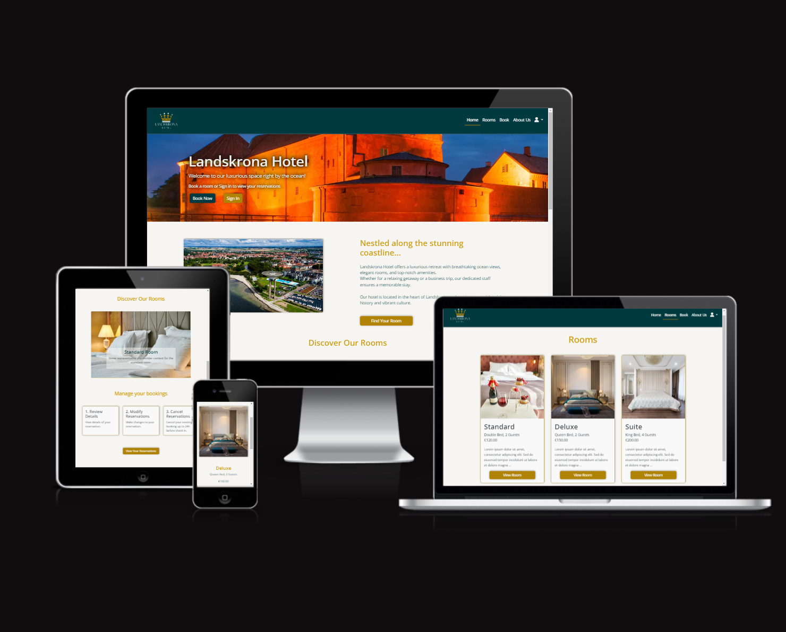

---

## Icon key

&#128272; <-- Superuser only access

&#128100; <-- Logged In Only

&#128683; <-- Logged Out only

&#9989; <-- Yes / Visible

&#10060; <-- No / Not visible

[Back to the top](#la-hotel)

---

## User Experience

### Initial Discussion

- This project is something I wanted to create as I'm a passionate traveler which led me to use plenty of hotel booking sites and made me wanted to create a simple and seamless hotel booking site.
- I wanted to create a website linked to a database, which allows users to create a profile, log in, view hotel information, room details and make room reservations.
- I wanted the administration to be able to add, edit and delete hotel information, room details and reservations.

### User Stories

#### Epics
- The project was divided into various epics, which are large bodies of work encompassing potential features for the project.
- Each epic was then broken down into smaller user stories, with each story providing specific value to a user.
- User stories were created from the perspectives of both the hotel owner and the website users.

#### User Stories
- All user stories are added as issues on GitHub.
- Each user story details the value it provides, the acceptance criteria required for completion, and the tasks needed to complete it.
- You can find all User Stories in the [Github Project Board](https://github.com/users/EVondrus/projects/4)


### Project Goals

- The primary goal is to create an easily editable site that enhances the guest experience and simplifies hotel operations.
- Designed with a user-centric approach, the platform should meet the needs of site users, site owners, staff, and administrators.
- This project also showcases my proficiency in maintaining a database integrated with a website, providing full CRUD (Create, Read, - Update, and Delete) functionality using the Code Institute PostgreSQL database and Cloudinary services.

[Back to the top](#la-hotel)

---

## Design

### Color Scheme

- The main colors used in this site are Dark Slater Green, Gold/Beige and Cloudy White.
- These main colors are the colors in the hotels's logo, and they permeate through the site.
- These colors were each selected to embody the serene elegance and natural beauty of a Landskrona, reflecting the tranquil ambiance and sophisticated charm of the setting.
- A dark green has been used for the sucess messages, to signify that this is a successive action.
- A dark red has been used for all Delete buttons, to signify that this is a destructive action.
- The gold yellow has been used for the hover state of the call-to-action buttons and social icons.

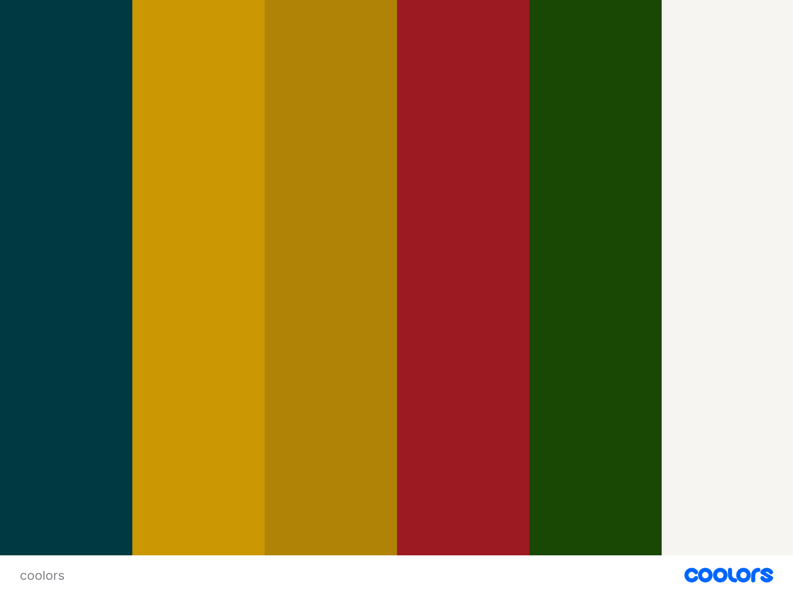

### Typography

- For the fonts, I selected Roboto Slab for Landskrona Hotel heading and Open Sans for the rest of the text, both available through Google Fonts.
- These choices were made with a keen focus on readability and accessibility, ensuring a welcoming experience for users with dyslexia and partial visual impairments.
- The elegance and readability of these fonts contribute to the app's overall sophistication and ease of use.
- By utilizing the standard HTML font size of 16px, ensuring to not have any fonts smaller than 12px, to aid visually impaired users.
- Also, the recommended smallest font size for accessible websites is 12px, so by keeping most of the font sizes at the HTML standard of (16px) or above, I ensured to be fully compliant with the [Penn State University Accessibility and Usability Guidelines](https://accessibility.psu.edu/fontsizehtml/).
- Font sizes are also able to be zoomed to 200% without losing contrast or functionality, to comply with the [WCAG Guidelines on fonts](https://www.w3.org/TR/UNDERSTANDING-WCAG20/visual-audio-contrast-scale.html).

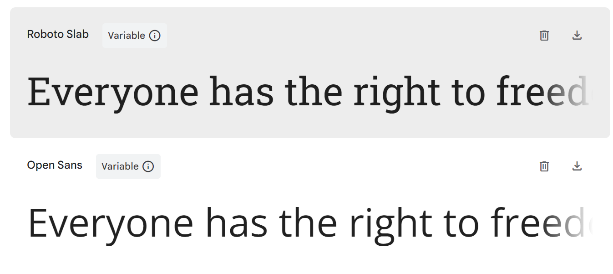

### Imagery

- The imagery and logo featured within this hotel reservation app are meticulously crafted using [Canva](https://www.canva.com/create/logos/)
- Integrated to forge a connection between the hotel's brand and the sites interface.
- Subtle box shadows have been artfully applied. These design elements echo the hotel's graphic styling, characterized by neutral, soft colors and refined lines, enhancing the app's aesthetic appeal.
- All links have their underlines removed for stylistic purposes. The links in the navigation bar re-gain their underlines when they're active.
- All interactable objects have hover and focus styles applied to make it clear to the user that those objects are interactable.
- Icons from [Font Awesome](https://fontawesome.com/) have been used on the site to add meaning where relevant and suitable. These icons are accompanied by either visible text or descriptive aria-labels, ensuring inclusivity and accessibility.
- Button colors have been used to convey meaning, mainly in the use of the color dark red to convey 'Delete' or 'Cancel' as dangerous actions.

### Wireframes
- At the start of this project, a series of wireframes were created to outline the initial design concepts.
- Please note that these wireframes represent the early stages of design and do not fully reflect the final implementation of the project.
  - [Wireframes for desktop and mobile for this project](./docs/wireframes)

[Back to the top](#la-hotel)

---

## Features

### Home page

- This feature allows the user to:
- Get a view of the hotel's ambiance with images and engaging text, providing visitors with a glimpse of the hotel's offerings.
- Viewing the room types in a carousell - each option linking to a detailed room description page with the choice to make a room reservation.
- View contact information and location.

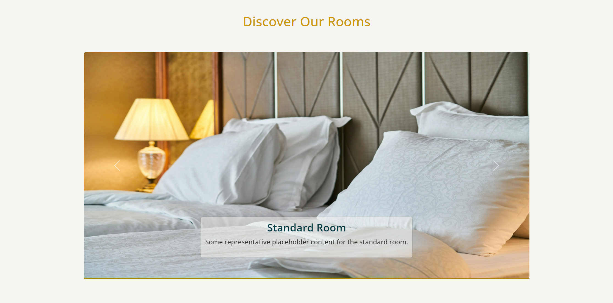

#### User profile registration

- This feature allows the user to:

  - Register for an account with their personal details to simplify the room reservation later:
    - Email
    - Username
    - First Name
    - Last Name
    - Address
    - Country
    - Postal Code
    - Phone No
    - Date of Birth
  - Ensure no typos by entering the password twice, with the site checking to confirm that the passwords match.
  - &#128100; Store their details for faster booking.
  - &#128100; Keep a record of their reservation history.

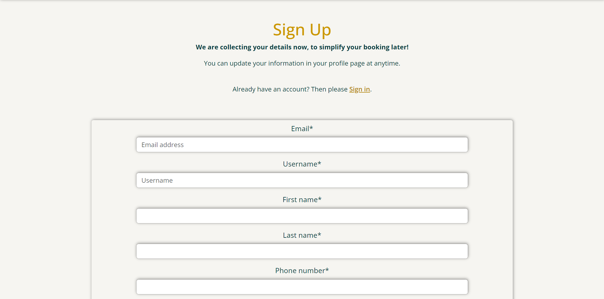
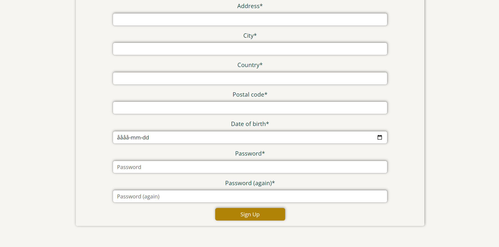

#### Log in

- This feature allows the user to:

  - Log in to the site with email address or Username and password.
    - Check the box to "remeber me" for upcoming logins.
    - Click the link to reset password if forgotten.
  - Browse their profile page.
    - View, update and delete their profile details.
  - Browse their room reservations (if they have any).
    - View, update and cancel room reservations.
  
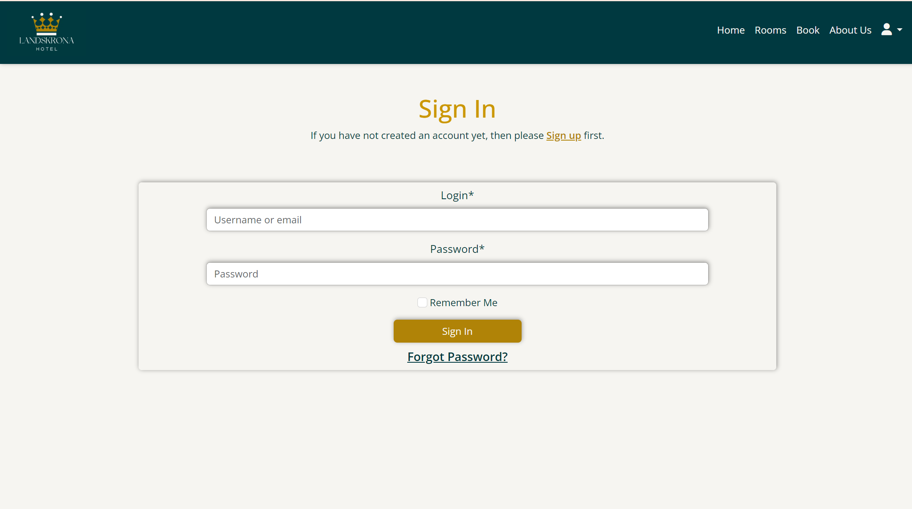

#### User Profile Page

- This feature allows the user to:

- View their personal details from the registration.
- Edit their personal details.
  - Upon submitting the editing of the profile a success message will be displayed.
- Delete their profile and account.
  - Upon deletion of their profile/account a deletion page will be displayed asking
  if the user is sure to delete their profile/account.

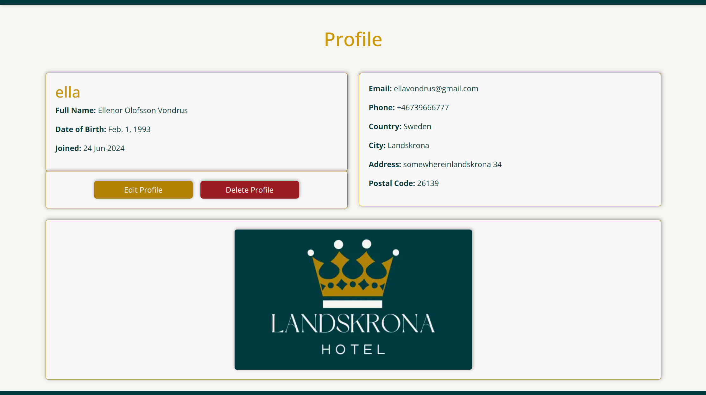


### Room Category page

- This feature allows the user to:

  - View all room categories of the hotel on the website.
    - Browse room categories through the main navigation bar or from the homepage.
  - Get an overview of what the different room categories offer, including a image, brief description of features and amenities, capacity and price.
  - Click on a room detail card to be redirected to the full room details pages.

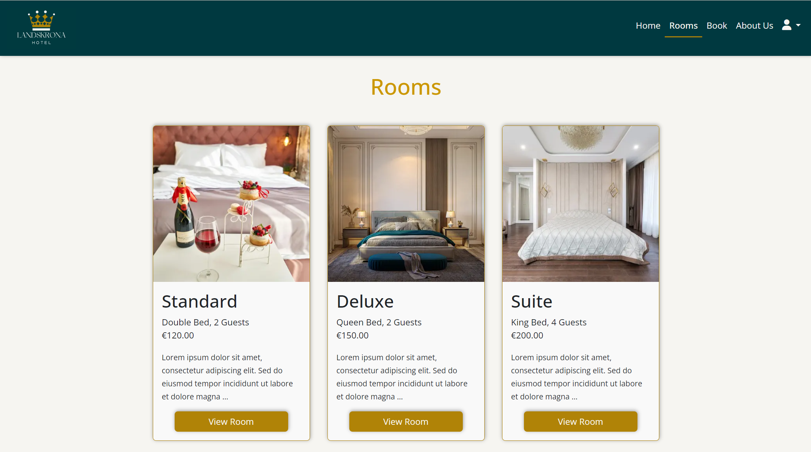


### Room Detail page

- This feature allows the user to:

  - View comprehensive details about each room category, including:

    - **Category:** The type of room (e.g., Standard, Deluxe, Suite).
    - **Price Per Night:** The cost associated with booking the room for one night.
    - **Capacity:** The maximum number of guests the room can accommodate.
    - **Image:** High-quality image showcasing the room.
    - **Description:** A detailed description of the room's features, amenities, and unique selling points.
  - **Booking Option:** Users have the option to proceed with booking the selected room by clicking the 'Book' button.
    - This action redirects them to a dedicated page designed for making reservations, where they can finalize their booking details.

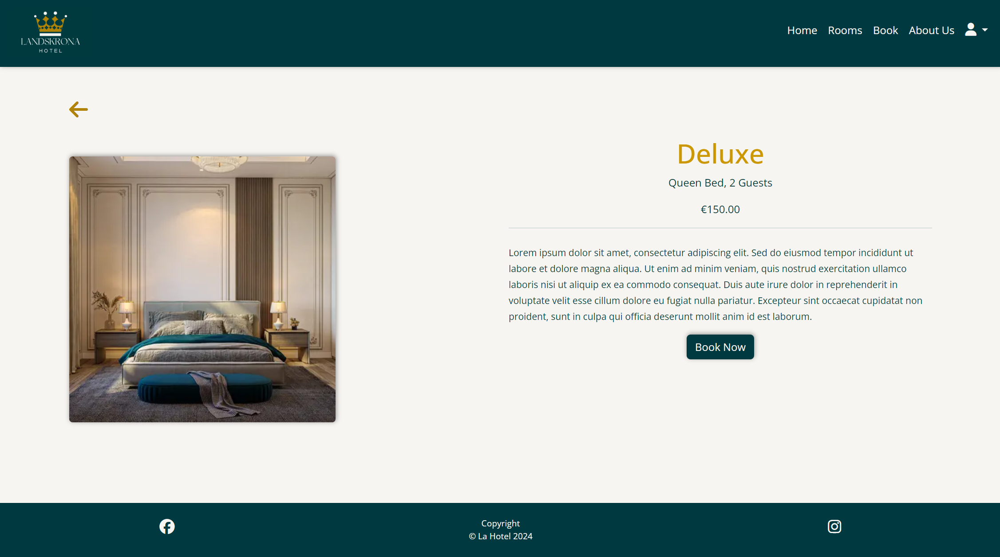

#### &#128272; Create, Edit and Delete Room details

- This feature allows the superuser via Admin panel to:
  - Add a new category and/or room details to the hotel.
  - Edit an existing categoy or room details.
  - Delete an existing category or room.
  - Include images, by uploading directly from the superuser's computer.


- This feature allows the superuser to:
  - Add a new details to the About and Contact page.
  - Edit an existing information.
  - Delete an existing information.
  - Include images, by uploading directly from the superuser's computer.


#### &#128272; Create, Edit and Delete Room reservations

- This feature allows the superuser to:
  - Add a new room reservation.
  - Edit an existing reservation.
  - Delete an existing reservation.

  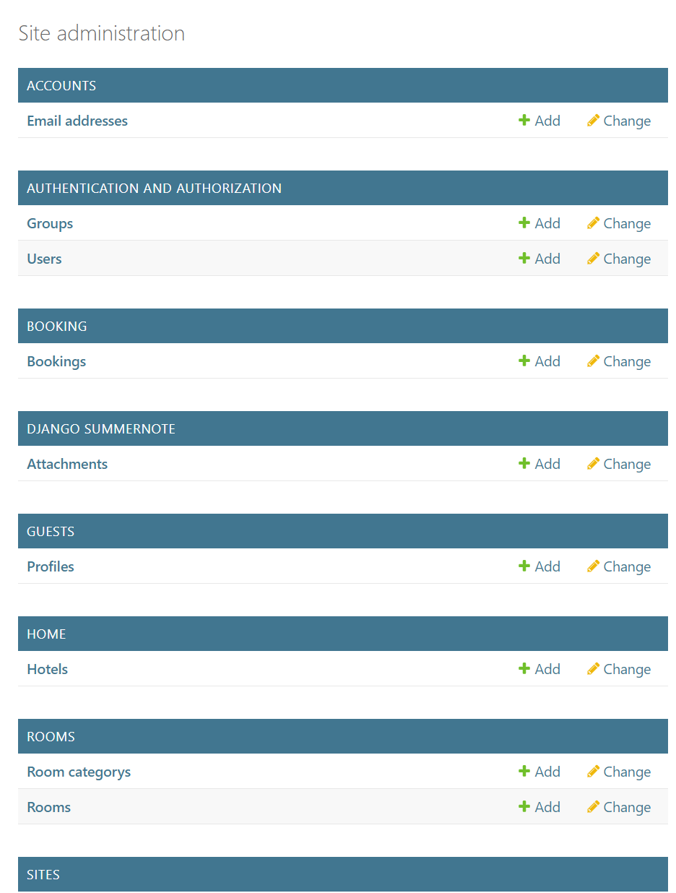

### Booking Page

- This feature allows the user to:
  - Make reservation as a logged in user
  - &#128100; The details from the user profile will be used in the reservation.
  - The details for the user to fill out in the booking form:
    - Check in date
    - Check out date
    - Number of guests.
    - Room category

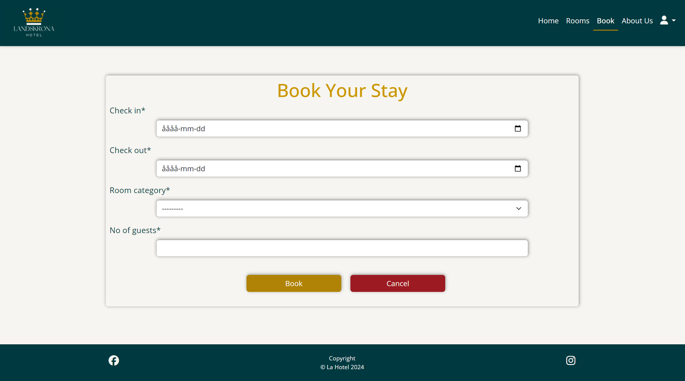

#### Reservation Confirmation

- If the reservation fails:
  - The user is directed back to the reservation form.
  - The user is shown a message that the reservation failed due to the reason eg.
  No rooms available for the desired dated.
- If the reservation succeeds:
  - The user will be displayed with a success page with reservation details.
  - The confirmation page contains full reservation details and booking id.
  - &#128100; The reservation will be added to the user's reservation page.

  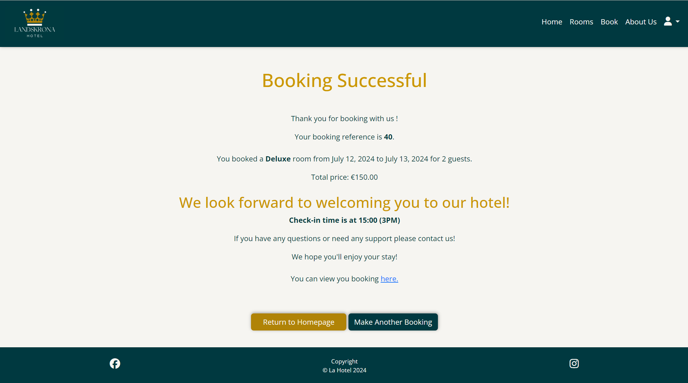

  ### Reservation Page

- This feature allows the user to:

  - View their reservation details.
  - Edit their reservation.
    - Upon submitting the editing of the reservation form a success message will be displayed.
  - Delete their reservation.
    - Upon deletion of their reservation a deletion page will be displayed asking
    if the user is sure to delete their profile/account.

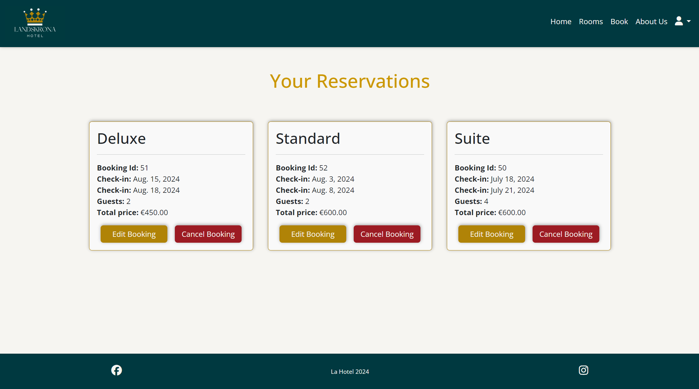

### Navigation bar

The navigation bar changes depending on user status and screen size:

| Nav Link         | &#128683; | &#128100; | &#128272; |
| ---------------- | --------- | --------- | --------- |
| Logo (Homepage)  | &#9989;   | &#9989;   | &#9989;   |
| Home             | &#9989;   | &#9989;   | &#9989;   |
| Rooms            | &#9989;   | &#9989;   | &#9989;   |
| Book             | &#10060;  | &#9989;   | &#9989;   |
| About            | &#9989;   | &#9989;   | &#9989;   |
| Profile          | &#10060;  | &#9989;   | &#9989;   |
| Reservations     | &#10060;  | &#9989;   | &#9989;   |
| Log Out          | &#10060;  | &#9989;   | &#9989;   |
| Log In           | &#9989;   | &#10060;  | &#10060;  |


- Navigation bar

- Logged in

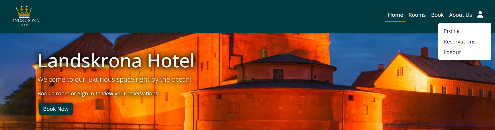

- Logged out

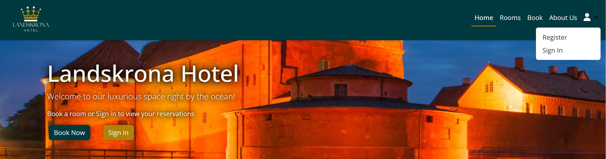

- Mobile 

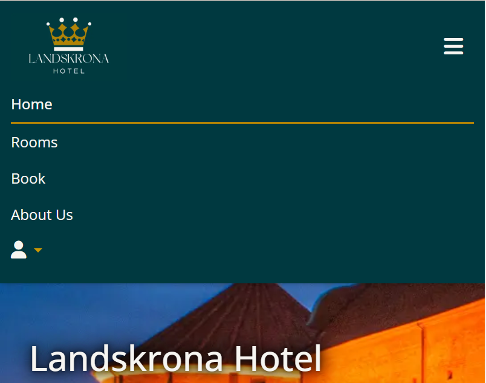

### About Section

- This feature allows the user to:

  - Read about the hotel, it's history and owners.


### Contact section

- This feature allows the user to:

  - Contact the hotel via email for queries about their stay or reservation.
  - View adress and location.
  - View phone number to contact the hotel in a quicker manner.

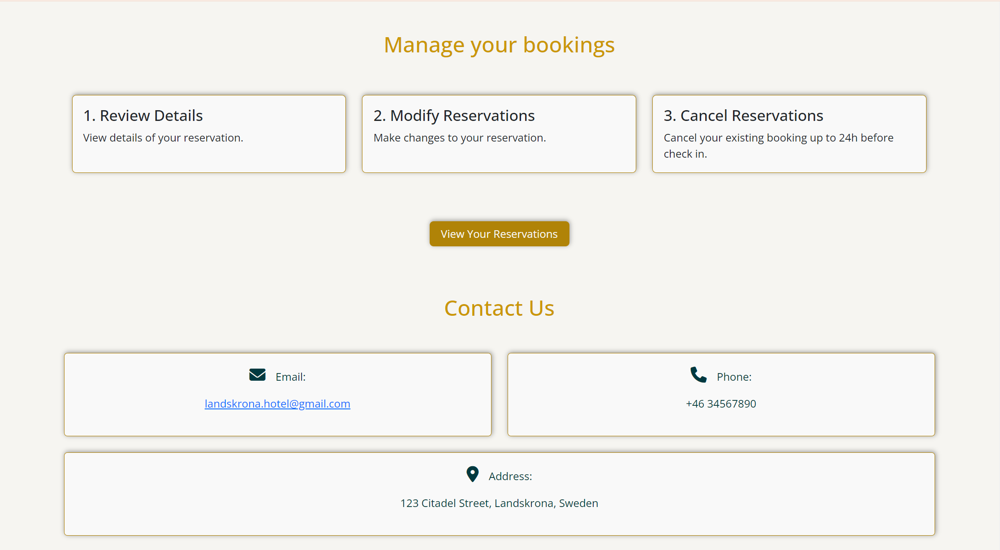

### Footer
- This feature allows the user to:
  - Navigate to any of the hotel's social media pages.

### Future Features

- For this project there are plenty future features that I would like to implement.
- All remaining user stories at the project deadline are stored in the product backlog, pending implementation in the next development cycle. For this project, GitHub milestones serve as the backlog.

- For the upcoming spring:

  - A form to check room availability on room category and room detail page.
  - Dashboard for the staff/receptionist to handle guests and reservations.
  - Dashboard for the admin/manager to handle hotel, room categories and room details.
  - Ability for the admin to add more images of the hotel and rooms.

### Defensive Design

In this project, defensive design principles are implemented to enhance user experience and system reliability. Informative feedback to users, ensuring clarity and guidance through success and error messages:

- Success Messages:
  - Upon successful form submissions or operations, users receive clear and affirmative messages confirming the completion of their actions. This helps maintain transparency and reassures users that their requests have been successfully processed.

  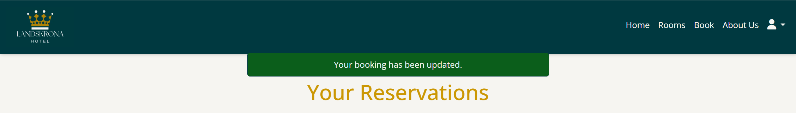

- Error Handling:
  - When forms contain invalid data or edits cannot be applied due to constraints, users are promptly notified with confirmation page or error messages. These messages are designed to be specific and actionable, guiding users on how to correct issues and proceed with their tasks effectively.

 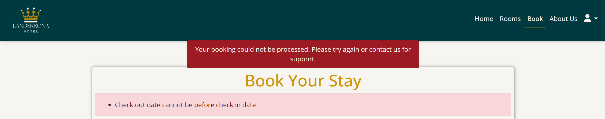
 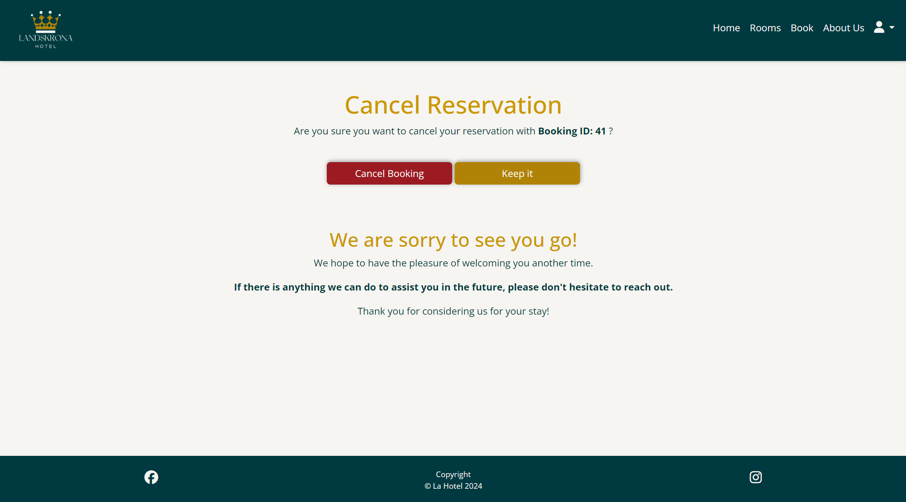

[Back to the top](#la-hotel)

---

### Database Design

This database uses a PostgreSQL database through Code Institute.
<br>

- [ER Diagram for this project](./docs/images/erd.png).

---

### Agile Development Process

#### Overview of Agile Methodology

- The development of Landskrona Hotel is guided by Agile principles, emphasizing flexibility, continuous improvement, and rapid adaptation to change. Although not strictly following traditional Agile practices like scheduled sprints or scrums, the development process is inspired by Agile methodologies.

- Rather than using sprints with defined start and end dates, the project focuses on a milestones of the overall deadline. This straightforward approach prioritizes the development of core functionalities first before expanding to more complex features.

- When encountering bugs or issues, they are recorded as bug issues and added to the backlog. This allows continuous progress in other areas while periodically revisiting and prioritizing the backlog based on severity and impact. This method ensures that development momentum is maintained while systematically addressing and resolving issues.

- User feedback is actively sought and analyzed to identify areas for improvement, ensuring that the product continuously evolves to meet the needs and expectations of its users effectively.

For details please follow link to: [Github Project board](https://github.com/users/EVondrus/projects/4)

### MoSCoW Prioritization

- Labels were added to user stories to assist with prioritization of tasks. 
- The MoSCoW system involves adding labels for:
  - MUST HAVE
  - SHOULD HAVE
  - COULD HAVE
  - WON'T HAVE
- This method assists in ensuring that essential features are completed first, optimizing resource allocation and meeting critical deadlines.

For details please follow link to: [Issues list](https://github.com/EVondrus/la-hotel/issues)

--- 

## Technologies Used

### Languages Used

#### HTML

- [HTML5](https://developer.mozilla.org/en-US/docs/Web/Guide/HTML/HTML5)

#### CSS

- [CSS3](https://developer.mozilla.org/en-US/docs/Archive/CSS3#:~:text=CSS3%20is%20the%20latest%20evolution,flexible%20box%20or%20grid%20layouts.)

#### JavaScript

- [JavaScript](https://developer.mozilla.org/en-US/docs/Web/JavaScript)

#### Python

- [Python](https://www.python.org/)
- This project uses Python 3.12.3.

### Workspace

#### GitPod & Visual Studio Code

- [Visual Studio Code](https://code.visualstudio.com/) was used as a local IDE workspace to build the site.

### Version Control

#### Git

- [Git](https://git-scm.com/) Git was used for version control. The Gitpod and VS Code terminals were utilized to add, commit to Git and pushed to GitHub.

#### GitHub

- [GitHub](https://github.com/) is used to store the code for this project.

### Wireframing

#### Balsamiq

- [Balsamiq](https://balsamiq.com/) was used for creating wireframes to plan the layout and structure of the site

#### Database Design

- [Lucidcharts](https://lucid.co/) was used to create Entity-Relationship Diagrams (ERDs) to design the database schema.

### Responsive Design

#### Am I Responsive Design

- [Am I Responsive Design](http://ami.responsivedesign.is/#) was used to check the site's responsive design and create the final site image.

#### Responsinator

- [Responsinator](http://www.responsinator.com/) was used to improve the site's responsive design on a variety of devices.

### Documentation

#### Shields.io

- [Shields.io](https://shields.io/) was used to create the GitHub badges for the top of this README.md file.

### Site Design

#### Font Awesome

- [Font Awesome](https://fontawesome.com/) was used on all pages to add icons.

#### Google Fonts

- [Google Fonts](https://fonts.google.com/) was used to select the fonts for the site.

#### Favicon.io

- [favicon.io](https://favicon.io/) was used to create the site favicon.

#### Canva

- [Canva](https://www.canva.com/create/logos/) was used to create the site logo.

### Tiny PNG

- [TinyPNG](https://tinypng.com/) was used to compress images.

### Coolors

- [Coolors](https://coolors.co/) was used to create the site color palette.


### Packages 

| Name                | Purpose                  |
| ------------------- | ------------------------ |
| Django              | Framework                |
| django-allauth      | Authentication           |
| django-crispy-forms | Front End Form Rendering |
| dj-database-url     | Database Configuration   |
| gunicorn            | WSGI HTTP Server         |
| Cloudinairy         | Cloud storage for media files |
| django-cloudinary-storage | Cloud storage for Django|
| psycopg2            | PostgreSQL database adapter |
| whitenoise          | Static file serving for WSGI applications |

[View the complete package list for the project here](./requirements.txt)

### Hosting

#### Heroku

- [Heroku](https://www.heroku.com) was used to deploy the live site.

### Frameworks, Libraries, and Others

#### Google DevTools

- [Google DevTools](https://developer.chrome.com/docs/devtools/)was used to identify the code corresponding to specific features.

#### Lighthouse

- [Lighthouse](https://developers.google.com/web/tools/lighthouse) was used to ensure the code was performant, followed best practices, and adhered to SEO and accessibility guidelines.

#### Bootstrap

- [Bootstrap](https://getbootstrap.com/) was used to create a beautiful, responsive website.

#### pip

- [pip](https://pip.pypa.io/en/stable/) was used to install the required dependencies for this site.

[Back to the top](#la-hotel)

---

## Deployment

<details id="prerequisites">
<summary style="font-size: 1.2em; font-weight: bold;">Prerequisites</summary>

Ensure that Python and pip (Python's package installer) are installed on your system. These tools are necessary for setting up the local development environment. The process works as follows:

- Ensure [Python](https://www.python.org/) is installed on your system.
- Verify that Python is installed on your system by checking its version. This can be done through a command in the terminal `python --version` or by running a small piece of Python code that outputs the version information.
- For installing libraries and modules, use `pip` or `pip3` depending on your Python version.

Important points for before deployment:
- The requirements for the project were added to a requirements.txt file using the command 'pip3 freeze > requirements.txt' in the terminal.
-  In .gitignore, include env.py to ensure sensitive information is not pushed to GitHub. 
-  In settings.py, link SECRET_KEY to the env.py file where the secret key variable is defined.
-  In settings.py, set 'DEBUG = False' to prevent verbose error pages and to prevent Django serving static files itself instead of relying on Cloudinary.
-  It is necessary to make migrations and migrate the models to the database before deployment.

[Back to the top](#la-hotel)  

</details>

<details id="heroku-deployment">
<summary style="font-size: 1.2em; font-weight: bold;">Heroku Deployment</summary>

<br>

1. **Heroku Account:**
   - Make sure you have a Heroku account. If not, sign up on the Heroku website.
   
2. **GitHub Repository:**
   - Ensure your project is hosted on GitHub.
   
3. **Heroku Dashboard:**
   - Log in to your Heroku account and go to the Heroku Dashboard.
   
4. **Create a New App:**
   - On the dashboard, click `New` and choose `Create new app`.
   
5. **App Name:**
   - Choose a unique name for your app, it cannot be the same as this app.
   
6. **Region & Create App:**
   - Choose a region closest to you (EU or USA), then Select **Create App**

7.  **The page of your project opens.**

8.  **Heroku Postgres**
    - Go to Resources Tab, Add-ons, search and add Heroku Postgres

9. **New App**
   - From the new app choose **Settings**, goto section 'Config Vars' click **Reveal Config Vars**, 
   
    - Config Vars for development of this project:
        - CLOUDINARY_URL
        - DISABLE_COLLECTSTATIC
        - DATABASE_URL 
        - EMAIL_HOST_PASS
        - EMAIL_HOST_USER
        - SECRET_KEY
        - HOST
 
    - Config Vars for production:
        - CLOUDINARY_URL
        - DATABASE_URL 
        - EMAIL_HOST_PASS
        - EMAIL_HOST_USER
        - SECRET_KEY 
        - HOST

**=> Go back to your code**

10. **Procfile**
    - Add the Procfile to your application's root directory ```echo web: node index.js > Procfile```. Heroku relies on this file to determine how to run your application, ensuring the correct setup of your web server. Use commands like `web: gunicorn PROJ_NAME.wsgi` in the Procfile to instruct Heroku on starting your web server with Gunicorn

11. In settings in your app add Heroku to ALLOWED_HOSTS

12. Add and commit the changes in your code and push to github

13. **Add Buildpack**
   - Scroll further down on the page, select **Add Buildpack**. The buildpacks will install further dependencies that are not included in the 'requirements.txt'. 
   - It's crucial to arrange the build packs correctly! First, choose Python and then Node.js. If they're not in this sequence, you can reorder them by dragging.
   
14. **Deploy**
    - From the tab above select the 'deploy section'.

15. **GitHub**
    - For deploying this project, we're using GitHub as our method. After choosing GitHub, make sure to confirm the connection. Then, search for your repository name and once Heroku finds your repository - click "connect"

16. **Choose deploy method**
    - Scroll down to the section "Automatic Deploys". 
    - Click "Enable automatic deploys" or choose "Deploy branch" and manually deploy.
    - Click "Deploy branch" wait for the app to be built. Once this is done, a message should appear letting us know that the app was successfully deployed. 
    - Click the button "View" to see the app.

[Back to the top](#la-hotel)  

</details>

<details id="local-deployment">
<summary style="font-size: 1.2em; font-weight: bold;">Local Deployment</summary>

<br>

#### How to Fork

1. Log in (or sign up) to Github.
2. Go to the [repository](https://github.com/EVondrus/la-hotel) for this project, 
3. Click the Fork button in the top right corner and select create a fork.
4. One can change the name of the fork and add description
5. Choose to copy only the main branch or all branches to the new fork.
6. Click Create a Fork. A repository should appear in your GitHub

#### How to Clone

1. Log in (or sign up) to GitHub.
2. Go to the [repository](https://github.com/EVondrus/la-hotel) for this project, 
3. Click on the code button, select whether you would like to clone with HTTPS, SSH or GitHub CLI and copy the link shown.
4. Open the terminal in your code editor or open command-line interface on your computer and change the current working directory to the location you want to use for the cloned directory. 
5. Type 'git clone' into the terminal and then paste the link you copied in step 3. Press enter.
    - `$ git clone https://github.com/Evondrus/la-hotel`
6. Press Enter. Your local clone will be created.

#### Setting up your local environment

1. Create Virtual environment on your computer or use gitpod built in virtual environment feature.
2. Create .env file. Place in inside ScrollStack folder. It needs to contain the variables from step 9.
- Database URL can be obtained from XXX app, add PostgreSQL as an add-on when creating an app.
- Secret_key - is the django secret key can be generated here.


```text
DATABASE_URL = ...
SECRET_KEY = ...
DEVELOPMENT = True
```
3. Run command
``` pip3 install -r requirements.txt ```

[Back to the top](#la-hotel) 

</details>

### Testing

[Click here to view the full testing steps](/TESTING.md), which were completed on Google Chrome, Firefox, Abdroid, iOS and MUIU operative systems

### Solved Bugs

- By leveraging GitHub projects, all bugs and their respective solutions were documented and added.
- You can view the bug reports in the [Kanban board](https://github.com/users/EVondrus/projects/4/views/1).

### Known Bugs

- No known bugs.
- If you discover any bugs in my project, please let me know so that I can promptly address them.

[Back to the top](#la-hotel)

---

## Credits


Throughout the development of the Landskrona Hotel, numerous resources have been employed to guarantee a robust, user-friendly, and engaging platform. Below is a compilation of essential documentation, blogs, tutorials, and guides that have been pivotal in shaping the features and functionality of Landskrona Hotel:

### Code

- **Bootstrap**: 
  - Widely utilized for styling and responsive design, ensuring the site's accessibility across various devices. - [Bootstrap documentation](https://getbootstrap.com/).
- **Django**:
  - Django's documentation has been essential for backend development, serving as the backbone of the platform - [Django documentation](https://docs.djangoproject.com/en/5.0/).
- **MDN Server-Generic list and detail views**:
  - [MDN](https://developer.mozilla.org/en-US/docs/Learn/Server-side/Django/Generic_views) -  How to use Class based generic views.
- **django-allauth**:
  - Implemented for authentication processes; setup guidance was followed from both the official documentation and additional tutorials provided by Code Institute's PP4 blog walkthrough - [django-allauth](https://docs.allauth.org/en/latest/installation/quickstart.html)
- **Sources of inspiration and guidance in general**:
    - The Django Recipe Sharing Tutorial series by Dee Mc - [Django Recipe Sharing Tutorial series](https://www.youtube.com/@IonaFrisbee).
    - [Django Tutorial](https://youtu.be/n-FTlQ7Djqc?si=Hfm94TiD4vbWolwj) by Net Ninja. An outdated source, however Net Ninja is great at explaining the basic and fundamentals of Django.
- **W3 Schools**:
  - [W3Schools](https://www.w3schools.com/howto/howto_css_modals.asp) - Providing HTML and JavaScript for the modal on the profile page for editing profiles
- **Code Institute**:
  - The Django Blog walkthrough acted as a guidance through out this project on how to set up packages and settings.
- **Darshan Dev**:
  - [Django Hotel Management system](https://www.youtube.com/@darshandev1754) - Helped me with inspiration for the logic on how to build a project like this and to get started.

- **Lucid Software**:
  - [Diagramming in Lucidcharts](https://www.youtube.com/watch?v=xsg9BDiwiJE&t=25s) -  Provided a basic overview of ERDs and then gives step-by-step training on how to make an ER diagram with correct cardinality.

### Content

First of all, Thank you for the beautiful images provided by these artist!

**Home page**:
- The Hero image is taken by my self of the beautiful Landskrona Citadel in my hometown.

**Room Images**:

- Pexels
  - [Max Vakhtbovycn](https://www.pexels.com/photo/bedroom-with-table-under-lamps-near-bed-and-curtains-6899445/)
  - [Max Vakhtbovycn](https://www.pexels.com/photo/bedroom-interior-with-bed-near-pouf-6782577/)
  - [Engin Akyurt](https://www.pexels.com/photo/photo-of-wine-bottle-and-food-on-table-1579253/)

- **Pixabay**
  - [u_woqvkflr9w](https://pixabay.com/sv/photos/sovrum-rum-design-interi%C3%B6r-byggnad-8242517/)

- **Text Content:**
  - Generated by ChatGPT


### Acknowledgments

- The incredible **Swedish Community** channel on Slack for their immense support and assistance.
- Special thanks to **John Traas**, **Niclas Hugdahl**, and **Dee Mc** for their help and support when I encountered obstacles that I was unable to sort on my own.
- My mentor, **Antonio Rodruigez**, for guiding and supporting me in the right direction.
- My partner **Mladen Djurdjevic** for his unwavering support and for handling everything else while I focused on this project.

[Back to the top](#la-hotel)
