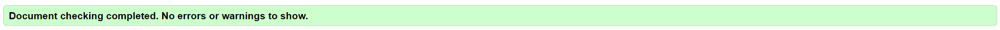
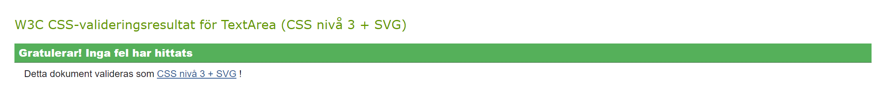
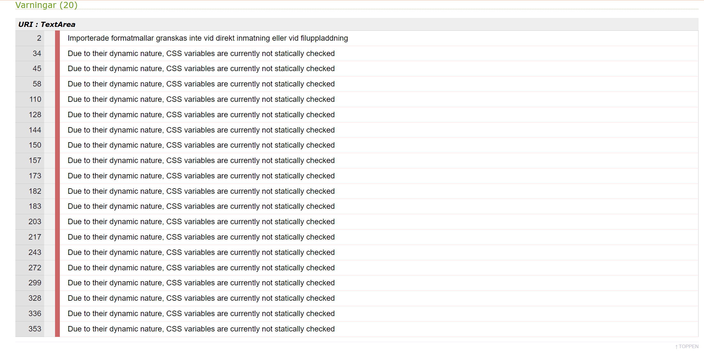
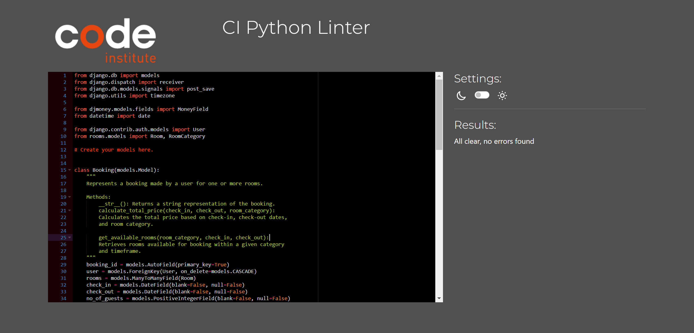
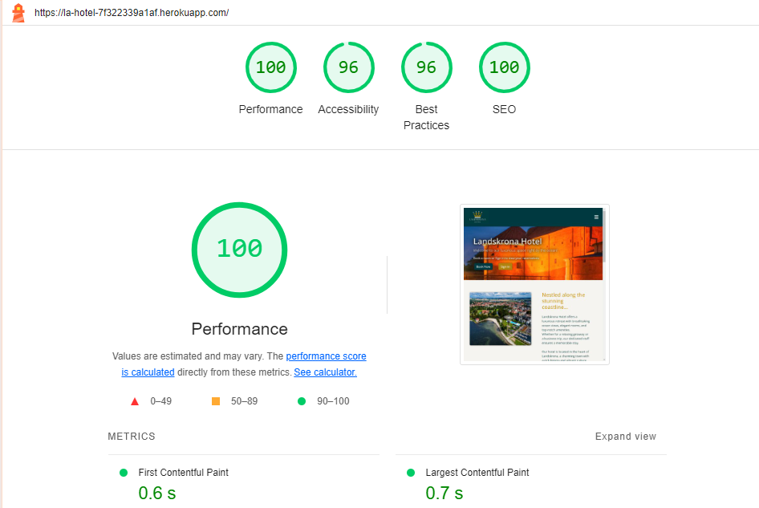
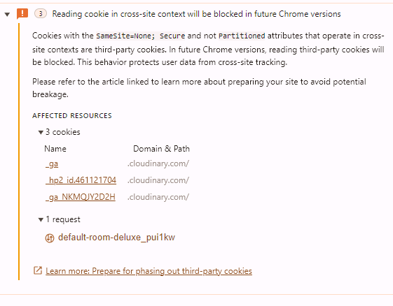

# Test Plan for Landskrona Hotel Reservation Site

## 1. Preparation
| Test Case | Description | Result | Comments |
|-----------|-------------|--------|----------|
| Environment Setup | Ensure all dependencies are installed and the server is running correctly | &#9989; | |
| User Accounts | Create test accounts for user and admin | &#9989; | |

## 2. Functional Testing

### Home Page
| Test Case | Description | Result | Comments |
|-----------|-------------|--------|----------|
| Navbar Links | Verify all links work correctly | &#9989; | Home, Rooms, Book, About and User menu links correctly to their respective pages |
| User Menu - Logged Out | Register and Login are displayed | &#9989; | |
| User Menu - Logged In | Profile, Reservation, and Logout are displayed | &#9989; | |
| Hero Image Buttons | Verify "Book" and "Sign In" buttons | &#9989; | Book button goes to Booking page and Sign in to Sign in page. Sign in button not visible when logged in |
| Find your room Button | Verify the button leads to the rooms page | &#9989; | |
| Room Carousel | Verify the carousel works correctly | &#9989; | On click it rides automatically |
| View reservation Button | Verify the button leads to the users reservations page | &#9989; | |
| Contact Section | Verify contact information is displayed correctly | | |

### Rooms Page
| Test Case | Description | Result | Comments |
|-----------|-------------|--------|----------|
| Room Cards | Verify all room category details are displayed correctly in cards | &#9989; | |
| View Room | Verify the button leads to the correct room detail page | &#9989; | |

### Room Detail Page
| Test Case | Description | Result | Comments |
|-----------|-------------|--------|----------|
| Room Information | Verify all room information is displayed correctly | &#9989; | |
| Book Button | Verify the button leads to the booking form page | &#9989; | |

### Booking Form
| Test Case | Description | Result | Comments |
|-----------|-------------|--------|----------|
| Form Fields | Verify all fields work and validate correctly | &#9989; | Check out cannot be before check in, cannot be on the same day. Room is not available for selected dates and no of guests cannot be over room capacity |
| Submit Booking | Verify booking works and displays success page | &#9989; | |

### Success Page
| Test Case | Description | Result | Comments |
|-----------|-------------|--------|----------|
| Booking Details | Verify booking details are displayed correctly | &#9989; | |
| Buttons | Verify the buttons | &#9989; | "Make another booking" links back to booking page and "Go to homepage" links to home |

### User Profile
| Test Case | Description | Result | Comments |
|-----------|-------------|--------|----------|
| View Profile | Verify all user details are displayed correctly | &#9989; | |
| Buttons | Verify the buttons | &#9989; | "Delete" button links to deletion page and "Edit" open modal for edit details |
| Edit Profile | Verify the user can edit their details | &#9989; | Updating correctly in database |
| Delete Page | Displays delete page with message | &#9989; | |
| Delete Account | Verify account and bookings are deleted correctly | &#9989; | Remove all details from database and log out user |
| Form Validation | Verify error messages display for invalid input | &#9989; | |
| Success Messages | Verify success messages display correctly | &#9989; | |

### Reservations
| Test Case | Description | Result | Comments |
|-----------|-------------|--------|----------|
| View Reservations | Verify all bookings are displayed correctly in cards | &#9989; | |
| Buttons | Verify the buttons | &#9989; | "Delete" button links to deletion page and "Edit" open page with form for edit details |
| Edit Reservation | Verify the user can edit their details | &#9989; | Updating correctly in database if form is valid |
| Form Validation | Verify error messages display for invalid input | &#9989; | Checks for valid dates, available rooms, no of guest |
| Success Messages | Verify success messages display correctly | &#9989; | |

### About Page
| Test Case | Description | Result | Comments |
|-----------|-------------|--------|----------|
| Content | Verify all information is displayed correctly | | |

### Logout Page
| Test Case | Description | Result | Comments |
|-----------|-------------|--------|----------|
| Logout Confirmation | Verify the logout function works | &#9989; | Page displaying to ask if user want to log out or stay ont the page |

### Footer
| Test Case | Description | Result | Comments |
|-----------|-------------|--------|----------|
| Social links | Verify the link works | &#9989; | Social media opens in a new tab |
| Year update | Verify that the year update works | &#10060; | Not been tested |

## 3. Usability Testing
| Test Case | Description | Result | Comments |
|-----------|-------------|--------|----------|
| Responsive Design | Test on different screen sizes and devices | &#9989; | Responsive on all screen sizes in Google DevTools and|
| Form Usability | Verify user-friendliness and clarity of validation messages | &#9989; | |

## 4. Performance Testing
| Test Case | Description | Result | Comments |
|-----------|-------------|--------|----------|
| Loading Time | Verify loading times for different pages | &#9989; | Within acceptable limits, Optimization could be explored |
| Responsiveness | Verify pages respond quickly to user interactions | &#9989; | |

## 5. Security Testing
| Test Case | Description | Result | Comments |
|-----------|-------------|--------|----------|
| Login Protection | Test multiple incorrect login attempts | &#9989; | |
| CSRF | Verify protection against CSRF | &#9989; | |

## 6. Compatibility Testing
| Test Case | Description | Result | Comments |
|-----------|-------------|--------|----------|
| Browsers | Test on the most popular browsers | &#9989; | Chrome, Firefox |
| Operating Systems | Test on different operating systems | &#9989; | Android 13, iOS 12, MIUI 13 |

## 7. Admin Panel Testing

### Login as Admin
| Test Case | Description | Result | Comments |
|-----------|-------------|--------|----------|
| Admin Login | Verify admin user can log in | &#9989; | |
| Access Control | Verify only admin can access the admin panel | &#9989; | |

## 8. Automated testing

### Code validators

#### HTML:
Validation was performed using the [W3C Markup Validation Service](https://validator.w3.org/#validate_by_input).  Some errors were found in the code automatically generated by Django, Summernote, and Crispy Forms. However, all custom-written code passed the tests successfully.
 

#### CSS:
Validated through [W3C CSS Validation Service](https://jigsaw.w3.org/css-validator/validator) and returns 0 error and 20 warnings.
 

The validator cannot parse this CSS selector because it supports CSS level 3, while the selector uses modern CSS level 4, which has not been implemented yet. The warnings arise from the use of CSS variables and font imports. However, these warnings can be ignored as the CSS functions correctly across all browser tests.

All other CSS styles passed without errors

### JavaScript:
Checked with [JSHint](https://jshint.com/) to test for errors and potential problems.

 Inline script in html has no errors.

### Python
All code validated through [PEP8 validator](https://pep8ci.herokuapp.com/) and all clear, no errors found.

- To view all python testing click [here](./docs/testing-images).

### Lighthouse testing

Used lighthouse to test performance, accessibility, best practices, and search engine optimization of the website.

- To view all Lighthouse testing click [here](./docs/testing-images).